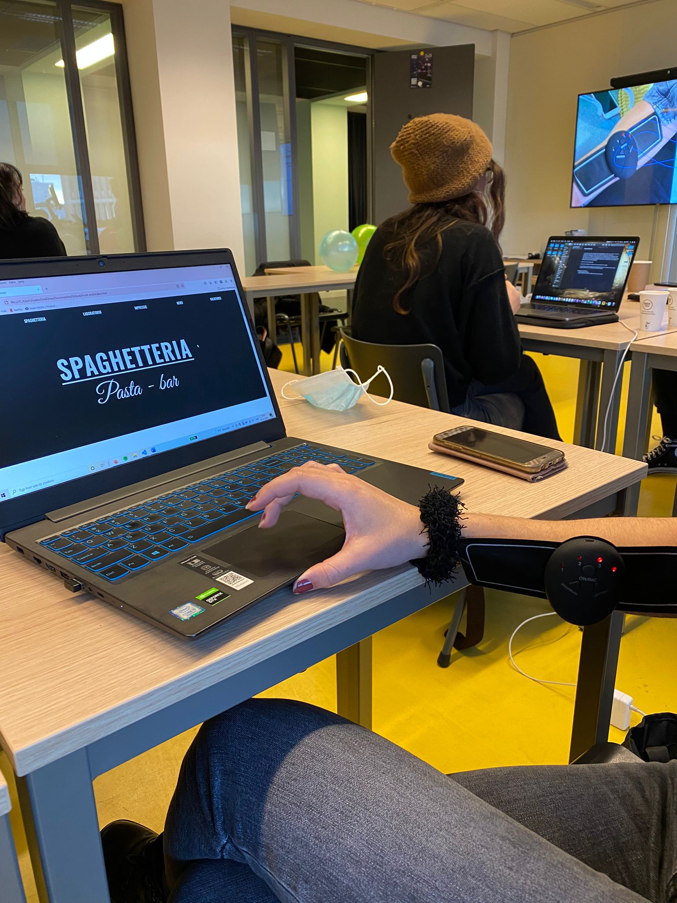

## Jij

uitwerken voor kick-off werkgroep

### Auteur:
Isabel Erven
 
#### Je startniveau:
Blauw
#### Je focus:
Surface plane
 

## Je website

uitwerken voor kick-off werkgroep

### Je opdracht:
https://www.spaghetteria.com/
 
#### Screenshot(s) van de eerste pagina (small screen): 
hier de naam van de pagina  

#### Screenshot(s) van de tweede pagina (small screen):
hier de naam van de pagina  

 

## Breakdownschets (week 1)

uitwerken na afloop 2e werkgroep

### de hele pagina: 

### dynamisch deel (bijv menu): 

## Voortgang 1 (week 2)

uitwerken voor 1e voortgang

### Stand van zaken
In week 1 had ik nog niet veel gedaan aan mijn code. Ik had uitgezocht welke lettertypes mijn site gebruikt, maar verder niks anders. Dit kwam doordat ik half week 1 en week 2 behoorlijk ziek was.

### Verslag van meeting
Door mijn ziekheid was ik niet aanwezig bij de eerste meeting.
 

## Voortgang 2 (week 3)

uitwerken voor 2e voortgang

### Stand van zaken
Week twee begon ik eindelijk aan mijn code. Ik had de html van de eerste site geschreven en de goede lettertypes hierop toegepast.

 
### Verslag van meeting
Na de meeting met de docent kreeg ik voornamelijk als advies om goed te werk te gaan deze week. Ik liep namelijk erg achter. Het idee was dat ik per les te werk moest gaan om zo alles in een goede volgorde een beetje in te halen.

## Toegankelijkheidstest (week 4)

uitwerken na test in 8e voortgang

### Bevindingen
Lijst met je bevindingen die in de test naar voren kwamen:
 - Knoppen moeten groot genoeg zijn. Dit is voor mensen die problemen hebben met hun ogen, maar ook als je last hebt van stuiptrekkingen.
 - P teksten zie je niet heel goed als je een wazig zicht hebt.
 - Contrasten waren goed alleen de rood op wit kleuren in de dark-theme niet.
 - Bij screen reader miste ik nog een aantal alt teksten.

#### Knopgroottes
In de les had ik mijn site uitgetest met een shockapparaat aan. Dit stimuleerd hoe mensen mijn site kunnen ervaren terwijl ze stuiptrekkingen hebben.
Het apparaat maakte mijn site moeilijker in gebruik doordat klikken erg lastig was. 
 

Ik los dit probleem op door :hover toe te voegen aan knoppen zodat je niet de muis per se hoeft te gebruiken en door de knoppen niet te klein maken.

#### P-teksten
In de les had ik ook meerdere brillen op gedaan om te onderzoeken of mijn site dan nog steeds goed werkt. Bij de bril die je zich wazig maakt, viel mij op dat de p teksten moeilijker te lezen werden

Ik los dit op door de teksten iets te vergroten dan de orginele site en door een knop te hebben die de teksten groter kan maken.

#### Dark theme 
Bij de rest van de brillen kon je het contrast van je site controleren. Bij de lichte versie van de site waren er nergens problemen, maar bij de donkere versie waren de grijze teksten moeilijk te lezen als ze een rode achtergrond hadden.

Dit ga ik oplossen door de grijze tekst kleuren iets witter te maken.

#### Alt teksten
In de les had ik ook een screenreader gebruikt. Bij dit ontdekte ik dat ik in mijn html op sommige plekken alt teksten was vergeten.

Dit los ik op door al mijn afbeeldingen na te gaan of ik overal wel alt teksten heb.

## Voortgang 3 (week 4)

uitwerken voor 3e voortgang

### Stand van zaken
Deze week had ik al aardig wat af aan mijn eerste pagina. Het was nog wel allemaal slordig en niet perfect, maar het was een goede basis
 
### Verslag van meeting
Bij de meeting werd er advies gegeven over de makkelijkste en snelste manier om te werk te gaan, omdat er meerdere mensen achterliepen. Ook kwam ik er tijdens deze meeting achter dat ik voor een mobiel moest ontwerpen en niet voor een desktop.

## Eindgesprek (week 5)

uitwerken voor eindgesprek

### Stand van zaken
hier dit ging goed & dit was lastig (neem ook screenshots op van delen van je website en code)
 
Deze week begon ik overnieuw met mijn site. Dit deed ik omdat mijn css echt een rommel was en ik dus toch voor het verkeerde schermformaat had geprogrammeerd. Uiteindelijk kreeg ik helaas niet mijn site af en ging ik voor de herkansing.

## Herkansing

 ### Stand van zaken
De week van de herkansing had ik lekker aangepoot met mijn website maken. Het programmeren liep behoorlijk goed en ik kwam niet veel echte moeilijkheden mee. Hier en daar liep ik wel vast, maar dan vond ik ook al snel een oplossing ervoor of een andere weg naar hetzelfde resultaat. Hieronder zie je mijn eindresultaat
 
 ### Screenshot(s)

hier screenshot(s) van je eindresultaat

## Bronnenlijst

continu bijhouden terwijl je werkt

Nb. Wees specifiek ('css-tricks' als bron is bijv. niet specifiek genoeg).

1. https://www.w3schools.com/Css/css_font_fallbacks.asp
2. https://developer.mozilla.org/en-US/docs/Learn/Forms/HTML5_input_types
3. https://academind.com/tutorials/adding-dark-mode
4. https://css-tricks.com/snippets/css/a-guide-to-flexbox/
5. https://www.digitalocean.com/community/tutorials/css-cropping-images-object-fit
6. https://www.youtube.com/watch?v=2KL-z9A56SQ
7. https://developer.mozilla.org/en-US/docs/Web/CSS/CSS_Selectors

